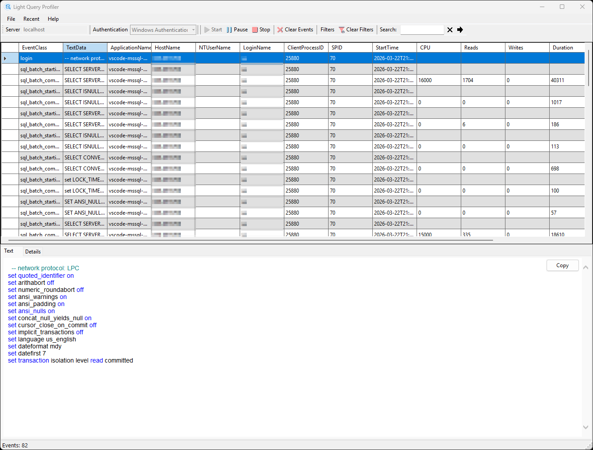

# Light Query Profiler

> A lightweight query profiler for SQL Server and Azure SQL Database — available as a desktop application and as a [VS Code extension](https://marketplace.visualstudio.com/items?itemName=brandochn.light-query-profiler).

## Table of Contents

- [General Info](#general-info)
- [Features](#features)
- [VS Code Extension](#vs-code-extension)
- [Requirements](#requirements)
- [Authentication Modes](#authentication-modes)
- [Supported Platforms](#supported-platforms)
- [Known Issues](#known-issues)
- [Status](#status)
- [Contributing](#contributing)
- [License](#license)
- [Contact](#contact)

---

## General Info

Light Query Profiler works with [Extended Events](https://docs.microsoft.com/en-us/sql/relational-databases/extended-events/quick-start-extended-events-in-sql-server?view=sql-server-ver16) to collect data needed to monitor and troubleshoot query performance issues in SQL Server and Azure SQL Database. It is available both as a standalone desktop application and as a Visual Studio Code extension.

&nbsp;

&nbsp;

---

## Features

- Real-time query profiling for SQL Server and Azure SQL Database
- Support for Windows Authentication, SQL Server Authentication, and Azure Active Directory
- Syntax-highlighted SQL query viewer
- Event filtering and full-text search
- Sortable, resizable event columns
- Detailed event inspection with tabbed view
- Cross-platform support: Windows, Linux, and macOS

---

## VS Code Extension

Light Query Profiler is available on the **Visual Studio Code Marketplace**:

**[Install from the VS Code Marketplace](https://marketplace.visualstudio.com/items?itemName=brandochn.light-query-profiler)**

### Getting Started with the VS Code Extension

1. Install the extension from the [VS Code Marketplace](https://marketplace.visualstudio.com/items?itemName=brandochn.light-query-profiler)
2. Open the Command Palette (`Ctrl+Shift+P` / `Cmd+Shift+P`)
3. Run **Light Query Profiler: Show SQL Profiler**
4. Enter your connection details:
   - Server name or IP address
   - Database name
   - Authentication mode and credentials
5. Click **Start** to begin profiling

---

## Requirements

- **[.NET 10 Runtime](https://dotnet.microsoft.com/en-us/download/dotnet/10.0)** must be installed and available in your `PATH`. This is required to run the profiler backend server.
- SQL Server 2012 or later, or Azure SQL Database
- The SQL login must have `ALTER ANY EVENT SESSION` permission to create Extended Events sessions
- For Azure SQL Database, at least the `VIEW DATABASE STATE` permission is required

---

## Authentication Modes

| Mode | Description |
|---|---|
| Windows Authentication | Uses the current Windows user credentials (Windows only) |
| SQL Server Authentication | Username and password |
| Azure Active Directory | Azure AD authentication for Azure SQL Database |

---

## Supported Platforms

The project runs on **Windows**, **Linux**, and **macOS**, provided .NET 10 is installed.

> **Note:** Windows Authentication is only available when running on Windows.

---

## Known Issues

- Windows Authentication is only available when running on Windows
- Azure SQL Database Managed Instance may require additional firewall configuration

---

## Status

Project is: _in progress_. Contributions are always welcome — feel free to submit a pull request.

---

## Contributing

Contributions, issues, and feature requests are welcome. Please check the [issues page](https://github.com/brandochn/LightQueryProfiler/issues) before submitting a new one.

1. Fork the repository
2. Create your feature branch (`git checkout -b feature/my-feature`)
3. Commit your changes (`git commit -m 'Add my feature'`)
4. Push to the branch (`git push origin feature/my-feature`)
5. Open a Pull Request

---

## License

This project is licensed under the MIT License — see the [LICENSE](https://github.com/brandochn/LightQueryProfiler/blob/main/LICENSE.md) file for details.

---

## Contact

Created by [Hildebrando Chávez](mailto:brandochn@gmail.com) — feel free to reach out!
