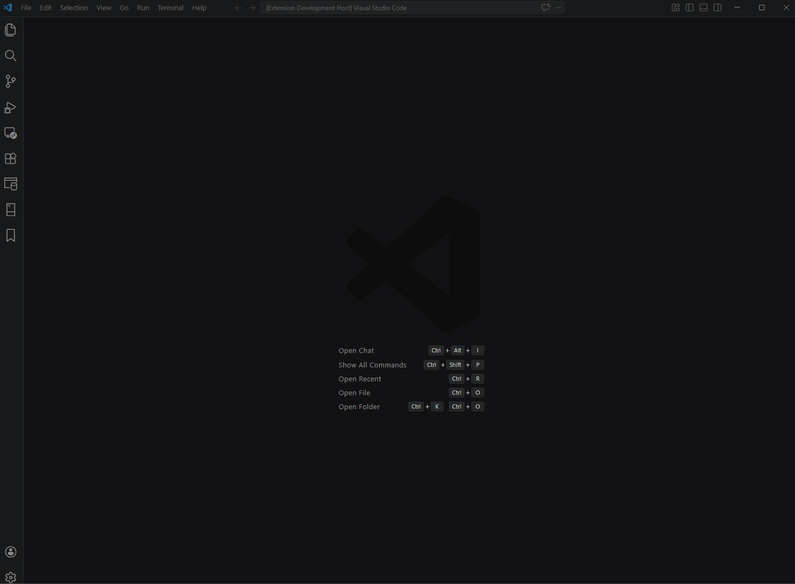

# Light Query Profiler

A SQL Server and Azure SQL Database query profiler for Visual Studio Code, powered by [Extended Events](https://docs.microsoft.com/en-us/sql/relational-databases/extended-events/quick-start-extended-events-in-sql-server).

## Features

- Real-time query profiling for SQL Server and Azure SQL Database
- Support for Windows Authentication, SQL Server Authentication, and Azure Active Directory
- Syntax-highlighted SQL query viewer
- Event filtering and full-text search
- Sortable, resizable event columns
- Detailed event inspection with tabbed view
- Export captured events to a JSON file for offline analysis or sharing
- Import previously exported events without needing an active SQL Server connection
- **Recent Connections**: Automatically saves connection settings after each session for quick reconnection

## Usage

### Starting a profiling session

Open the profiler panel, enter your connection details, and click **Start** to begin capturing SQL Server events in real time.

## Recent Connections

Light Query Profiler automatically saves your connection settings when you stop a profiling session. Open the **Recent Connections** panel to reconnect instantly without re-entering credentials.

- **Open the panel**: Click the **⏱ Recent...** button in the profiler toolbar, use the Command Palette → `Light Query Profiler: Show Recent Connections`, or click the history icon in the editor title bar.
- **Reconnect quickly**: Double-click any row in the list to pre-fill the profiler form (server, database, authentication mode, username, and password).
- **Search**: Type in the search box to filter by server name or database name.
- **Security**: Credentials are stored locally using AES-256-GCM encryption scoped to the current user and machine.

## Requirements

- **[.NET 10 Runtime](https://dotnet.microsoft.com/en-us/download/dotnet/10.0)** must be installed and available in your PATH. This is required to run the profiler backend server.
- SQL Server 2012 or later, or Azure SQL Database
- The SQL login must have `ALTER ANY EVENT SESSION` permission to create Extended Events sessions

## Getting Started

1. Install the extension
2. Open the Command Palette (`Ctrl+Shift+P` / `Cmd+Shift+P`)
3. Run **Light Query Profiler: Show SQL Profiler**
4. Enter your connection details:
   - Server name or IP address
   - Database name
   - Authentication mode and credentials
5. Click **Start** to begin profiling

## Export & Import Events

Light Query Profiler lets you save captured events to a JSON file and reload them later — no active SQL Server connection required.

### Exporting Events

1. Capture events by starting a profiling session
2. Click **⬆ Export...** in the toolbar, or run **Light Query Profiler: Export Events...** from the Command Palette (`Ctrl+Shift+P`)
3. Choose a destination and file name — the default is `ProfilerEvents_yyyyMMdd_HHmmss.json`
4. A confirmation shows the number of events exported

> **Note:** Up to 10,000 events are kept in memory per session. If more events are captured, the oldest ones are automatically removed.

### Importing Events

1. Click **⬇ Import...** in the toolbar, or run **Light Query Profiler: Import Events...** from the Command Palette
2. Select a previously exported JSON file
3. If events are already loaded, you will be asked to confirm the replacement
4. The imported events appear in the table immediately, with full search, sort, and filter support

### JSON File Format

The exported JSON is a plain array where each entry contains the event fields (EventClass, TextData, ApplicationName, Duration, CPU, Reads, Writes, etc.) plus two metadata fields:

- `__RowIndex` — preserves the original capture order
- `__Timestamp` — copy of the event start time for alternative sorting

The format is compatible with events exported from the **Light Query Profiler desktop application**.

## Authentication Modes

| Mode                      | Description                                              |
| ------------------------- | -------------------------------------------------------- |
| Windows Authentication    | Uses the current Windows user credentials (Windows only) |
| SQL Server Authentication | Username and password                                    |
| Azure Active Directory    | Azure AD authentication for Azure SQL Database           |
| Connection String         | Provide a full ADO.NET connection string. Supports any valid SQL Server or Azure SQL Database connection string. |

## Supported Platforms

The extension works on **Windows**, **Linux**, and **macOS**, provided .NET 10 is installed.

> **Note:** Extended Events sessions require appropriate permissions on the SQL Server instance. Azure SQL Database requires at least the `VIEW DATABASE STATE` permission.

## Extension Settings

This extension does not contribute any VS Code settings at this time.

## Known Issues

- Windows Authentication is only available when running VS Code on Windows
- Azure SQL Database Managed Instance may require additional firewall configuration

## License

MIT — see [LICENSE](https://github.com/brandochn/LightQueryProfiler/blob/main/LICENSE.md)
